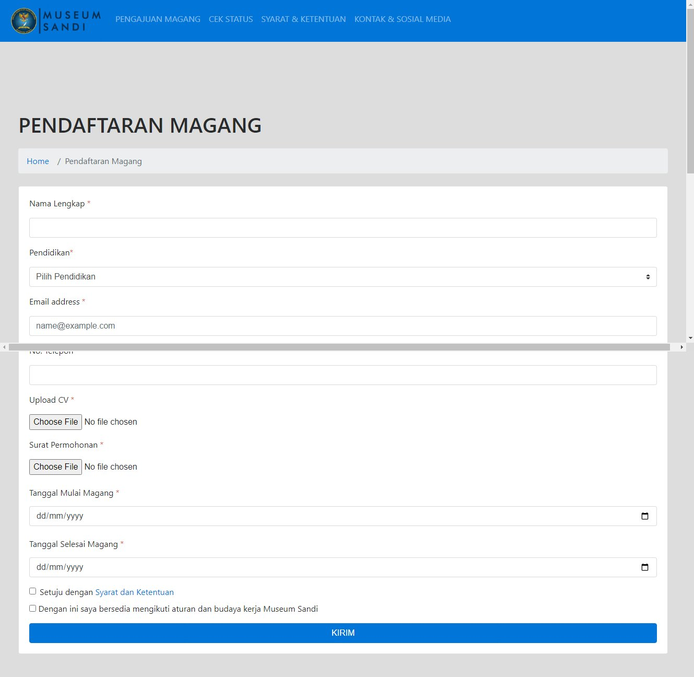
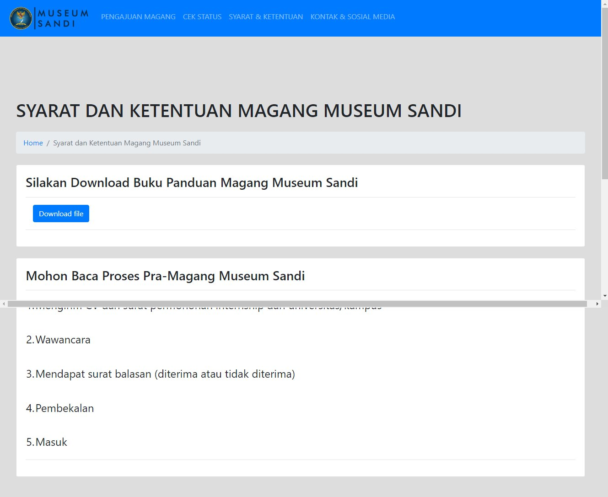

# Aplikasi Pendaftaran Peserta Magang Museum Sandi (CodeIgniter 3)

Aplikasi berbasis web untuk mengelola **pendaftaran peserta magang Museum Sandi**, dikembangkan menggunakan **CodeIgniter 3** dan **MySQL**.  
Project ini dibuat sebagai bagian dari kerja praktek dengan fokus pada backend & integrasi database.

---

## 📸 Preview

### Home

### Pengajuan magang

### Cek status peserta magang

### Syarat dan ketentuan

### Login admin

### Dashboard admin

---

Fitur

Pendaftaran peserta

Dashboard admin

Upload dokumen

---

## 🚀 Cara Install & Menjalankan

🚀 Clone repositori:

git clone https://github.com/username/nama-proyek.git

cd nama-proyek

🚀 Install dependencies:

composer install

npm install

npm run dev

🚀 Salin file .env dan sesuaikan:

cp .env.example .env

php artisan key:generate

🚀 Migrasi database:

php artisan migrate

🚀 Jalankan server:

php artisan serve

Buka browser: http://localhost:8000

---

Struktur Folder

/app

/config

/database

/public

/resources

/routes

***************

